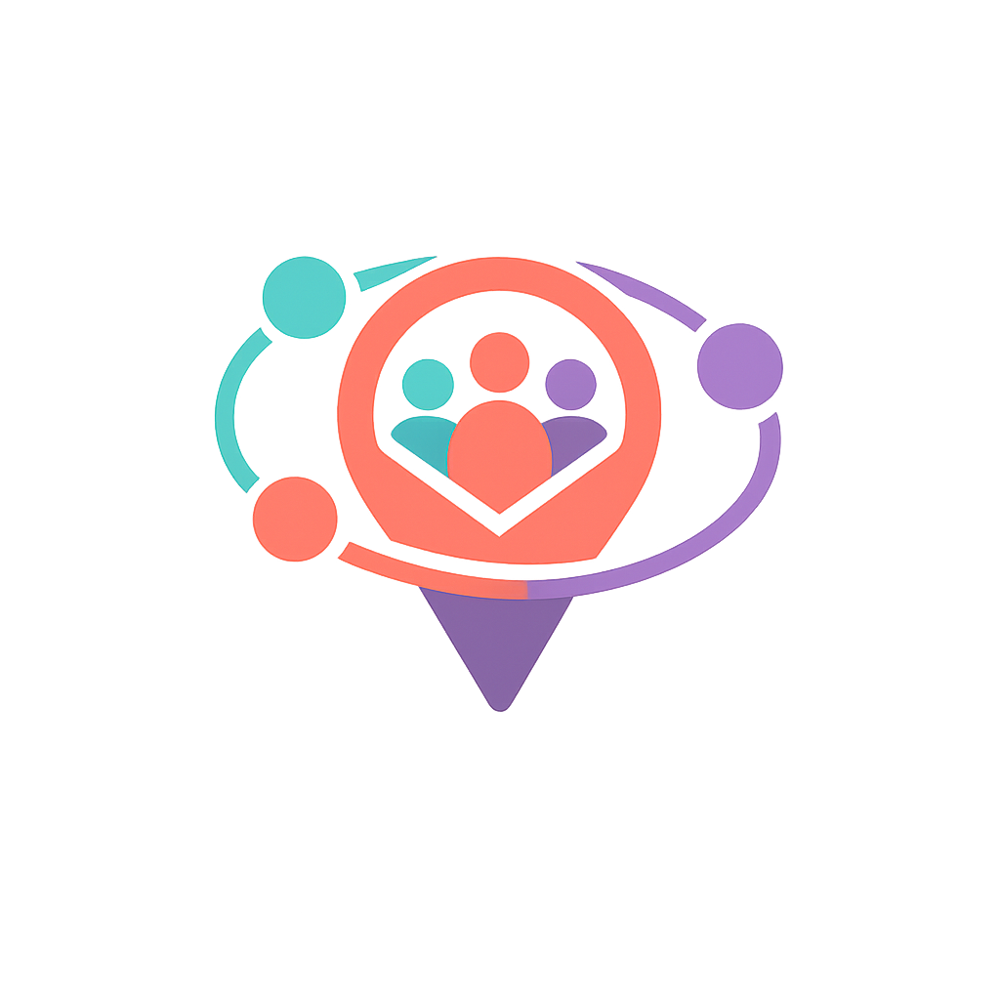

<p align="center">
  
</p>

# Moim

Moim is a federated events & places service. In Korean, it is written as '모임', pronounced /mo-im/, like "mo-eem". It means "gathering" or "meetup".

Built on TanStack Start, Drizzle, and ActivityPub.

## Quickstart

```bash
pnpm install
cp .env.example .env
docker-compose up
pnpm db:migrate
pnpm dev
```

## ActivityPub

- Webfinger: `/.well-known/webfinger`
- NodeInfo: `/.well-known/nodeinfo`, `/nodeinfo/2.0`
- Actor: `/ap/{identifier}`
- Inbox: `/ap/{identifier}/inbox`
- Outbox: `/ap/{identifier}/outbox`
- Human profile: `/@/{identifier}`

## OTP Auth

1. `POST /api/auth/otp-requests` with `{ "handle": "alice@example.com" }`
2. Post the OTP on the fediverse.
3. `POST /api/auth/otp-verifications` with `{ "handle": "alice@example.com" }`

## API Routing

- All app/business endpoints registered in `src/server-entry.ts` live under `/api`.
- UI pages keep their TanStack Start routes such as `/events/create` and `/groups/create`.
- ActivityPub and federation endpoints remain outside `/api` under `/.well-known/*`, `/nodeinfo/*`, and `/ap/*`.

Examples:

- `GET /api/session`
- `GET /api/events`
- `POST /api/events`
- `GET /api/groups/by-handle/{handle}`
- `PATCH /api/groups/{groupId}`
- `POST /api/check-ins`
