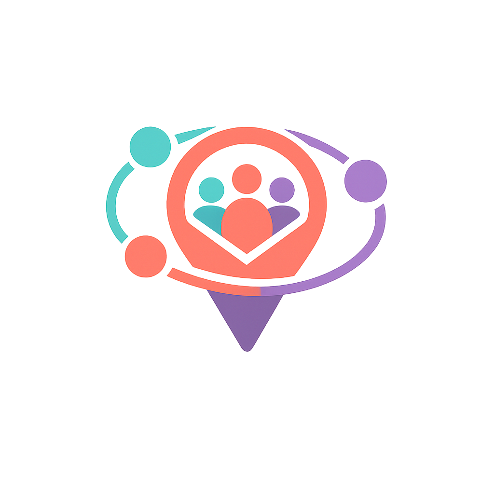

<p align="center">
  
</p>

# Moim

Moim is a federated events & places service. In Korean, it is written as '모임', pronounced /mo-im/, like "mo-eem". It means "gathering" or "meetup".

Built on TanStack Start, Drizzle, and ActivityPub.

## Quickstart

```bash
pnpm install
cp .env.example .env
docker compose up -d
pnpm db:migrate
pnpm dev
```

## Features

- **Events** -- create, publish, RSVP, attendee tracking, event dashboards, ICS calendar feeds
- **Groups** -- federated Group actors, member management, group posts, RSS feeds
- **Places** -- location management, H3 geo indexing, check-ins, nearby search, map snapshots
- **Polls** -- group polls with federated Question/Vote support
- **Discussions (CRM)** -- attendee inquiries and organizer replies on events
- **Authentication** -- Fediverse OTP, Misskey MiAuth, Mastodon OAuth, linked accounts
- **Admin panel** -- user/group/event/place/banner/category management
- **ActivityPub federation** -- actors, inbox/outbox, WebFinger, NodeInfo, content negotiation

## ActivityPub

- WebFinger: `/.well-known/webfinger`
- NodeInfo: `/.well-known/nodeinfo` → `/nodeinfo/2.1`
- Actor: `/ap/actors/{identifier}` (content-negotiated)
- Inbox: `/ap/actors/{identifier}/inbox`
- Shared inbox: `/ap/inbox`
- Outbox: `/ap/actors/{identifier}/outbox`
- Notes: `/ap/notes/{noteId}`
- Questions: `/ap/questions/{questionId}`
- Places: `/ap/places/{placeId}`
- Human profiles: `/groups/@{identifier}`, `/users/@{identifier}`

## Authentication

### Fediverse OTP

1. `POST /api/auth/otp-requests` with `{ "handle": "alice@example.com" }`
2. Post the OTP on your Fediverse account.
3. `POST /api/auth/otp-verifications` with `{ "handle": "alice@example.com" }`

### Misskey MiAuth

1. `POST /api/auth/misskey/miauth-start` with the Misskey instance domain.
2. User authorizes on Misskey. Callback: `/auth/misskey/miauth-callback`

### Mastodon OAuth

1. `POST /api/auth/mastodon/oauth-start` with the Mastodon instance domain.
2. User authorizes on Mastodon. Callback: `/auth/mastodon/oauth-callback`

## API Routing

All business endpoints live under `/api`. ActivityPub and federation endpoints remain outside `/api` under `/.well-known/*`, `/nodeinfo/*`, and `/ap/*`.

| Domain | Examples |
|---|---|
| Auth | `POST /api/auth/otp-requests`, `GET /api/session`, `DELETE /api/session` |
| Users | `GET /api/users?query=…`, `GET /api/users/settings` |
| Groups | `POST /api/groups`, `GET /api/groups/by-handle/:handle`, `PATCH /api/groups/:groupId` |
| Events | `GET /api/events`, `POST /api/events`, `PUT /api/events/:eventId/rsvp`, `POST /api/events/:eventId/publish` |
| Discussions | `GET /api/events/:eventId/discussions`, `POST /api/events/:eventId/discussions/:inquiryId/replies` |
| Polls | `POST /api/groups/:groupActorId/polls`, `POST /api/polls/:pollId/vote` |
| Places | `GET /api/places`, `GET /api/places/nearby`, `POST /api/check-ins` |
| Admin | `GET /api/admin/users`, `GET /api/admin/banners`, `POST /api/admin/place-categories` |
| Feeds | `GET /groups/@{handle}/feed.xml` (RSS), `GET /groups/@{handle}/events.ics` (ICS) |

## Environment

Copy `.env.example` and review the variables. Key groups:

- **Database**: `DATABASE_URL`, `MIGRATION_DATABASE_URL`
- **Federation**: `FEDERATION_DOMAIN`, `FEDERATION_HANDLE_DOMAIN`, `FEDERATION_PROTOCOL`
- **S3 storage**: `AWS_ACCESS_KEY_ID`, `AWS_SECRET_ACCESS_KEY`, `S3_BUCKET`, `S3_ENDPOINT`
- **Admin**: `INSTANCE_ADMIN_HANDLES`

See `.env.example` for the full list with defaults.
